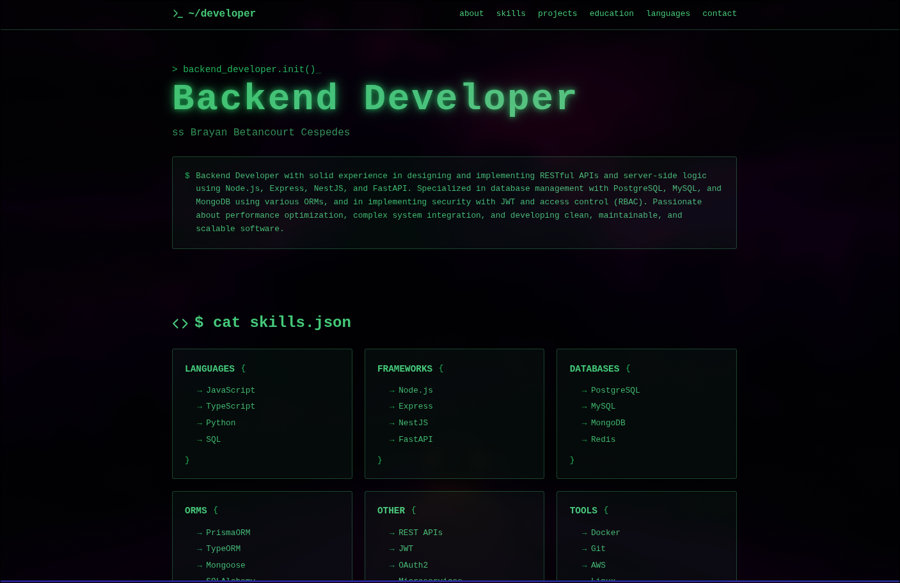

# Brayan Betancourt - Backend Developer Portfolio

[](https://bryandev.dev)

A modern, responsive portfolio website showcasing my skills, projects, and experience as a Backend Developer. Built with React, TypeScript, and Tailwind CSS.

## 🚀 Features

- **Modern UI** with a clean, terminal-inspired design
- **Responsive** layout that works on all devices
- **Interactive** elements with smooth animations
- **Dark theme** with green accents for better readability
- **Project showcase** with detailed descriptions
- **Contact section** with multiple ways to get in touch

## 🛠️ Technologies Used

- **Frontend**: React, TypeScript, Vite
- **Styling**: Tailwind CSS
- **Icons**: Lucide Icons
- **Deployment**: [Add your deployment platform]

## 📋 Sections

- **About Me** - Brief introduction and overview
- **Skills** - Technical skills and technologies I work with
- **Projects** - Showcase of my best work
- **Education** - Academic background and certifications
- **Contact** - Get in touch with me

## 🚧 Projects

### E-commerce Platform
- **Description**: Full-stack e-commerce solution with secure authentication and payment processing
- **Tech Stack**: Node.js, Express, PostgreSQL, Prisma, JWT, WebSockets
- **Features**: User roles, payment integration, real-time updates

### Online Course Platform
- **Description**: Learning management system with role-based access control
- **Tech Stack**: Node.js, NestJS, MongoDB, JWT, Mongoose
- **Features**: Secure authentication, course management, user roles

### Social Network Backend
- **Description**: Social media platform with image recognition
- **Tech Stack**: Node.js, Express, PostgreSQL, Prisma, FastAPI, TensorFlow
- **Features**: Real-time notifications, ML-based image classification

### Customer Management System
- **Description**: Robust CRM module with clean architecture
- **Tech Stack**: Python, FastAPI, PostgreSQL, SQLAlchemy
- **Features**: RESTful API, JWT authentication, comprehensive testing

## 🎓 Education

- **Computer Science Engineering**  
  *Universidad Camilo Cienfuegos Matanzas/Cuba*  
  *2020 - 2024*

## 📞 Contact

- 📧 Email: [brayancespedes57@gmail.com](mailto:brayancespedes57@gmail.com)
- 💼 GitHub: [Bryan4638](https://github.com/Bryan4638)
- 💬 Telegram: [@mcGr3_BR](https://t.me/mcGr3_BR)
- 📱 WhatsApp: [+5354383812](https://wa.me/5354383812)

## 🚀 Getting Started

1. Clone the repository:
   ```bash
   git clone https://github.com/Bryan4638/portfolio.git
   cd portfolio
   ```

2. Install dependencies:
   ```bash
   npm install
   ```

3. Start the development server:
   ```bash
   npm run dev
   ```

4. Open [http://localhost:5173](http://localhost:5173) to view it in your browser.

## 📄 License

This project is licensed under the MIT License - see the [LICENSE](LICENSE) file for details.

---

Made with ❤️ by Brayan Betancourt
